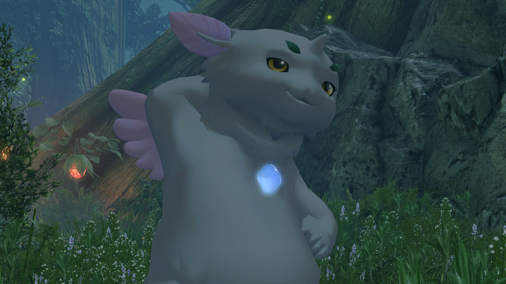
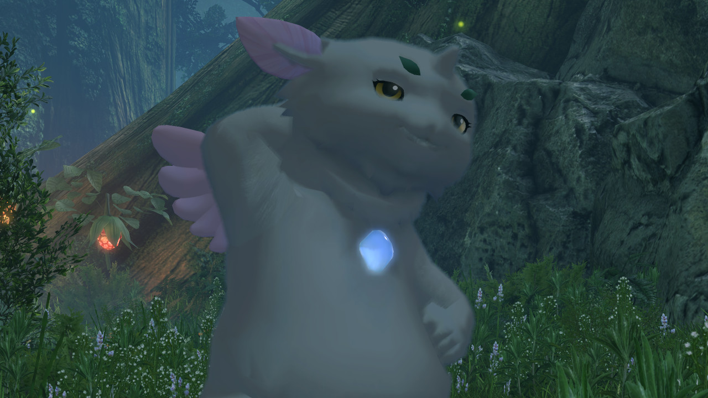

# Fur Materials

## Fur Shells

  
  

Most of the fur materials for Xenoblade 1 DE, Xenoblade 2, and Xenoblade 3 use a technique known as shell-based fur. Similar to the inverted hull technique used for [outlines](./outline.md), the game renders increasingly scaled copies of the mesh with increasingly lower transparency to approximate the fuzzy look of fur. This technique is common in older games due to its low performance cost compared to rendering individual strands. 

Each shell is scaled along the normal or "inflated" to adjust its thickness. The number of shells is determined by the instance count used for instanced rendering. The instance ID is used in the calculation of the shell thickness and transparency. Gramps uses 4 shell instances in the above screenshot.