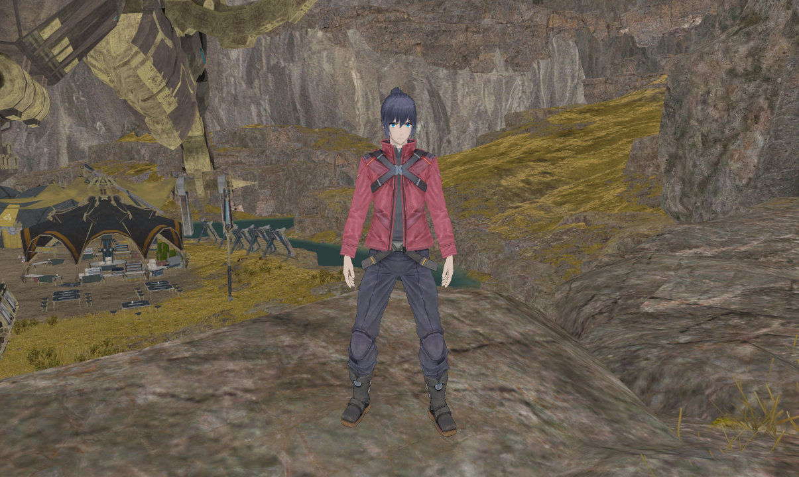
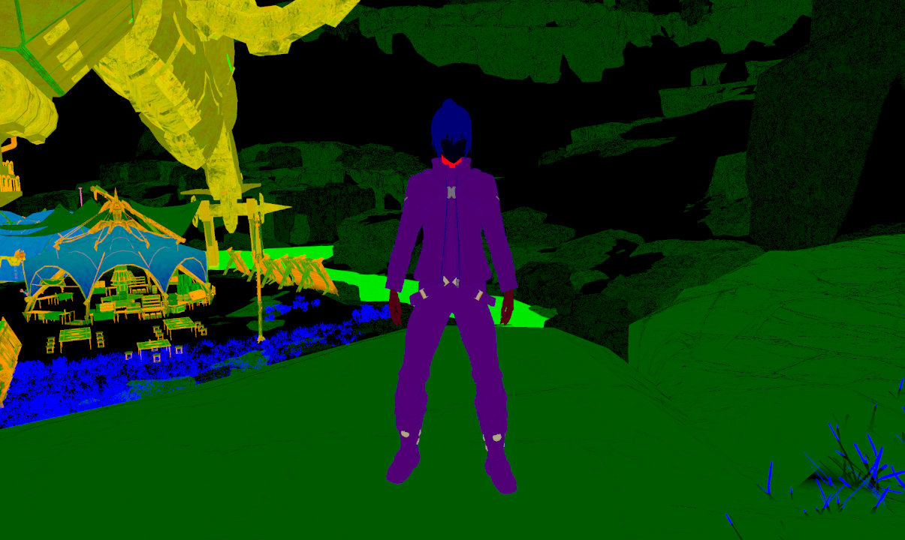
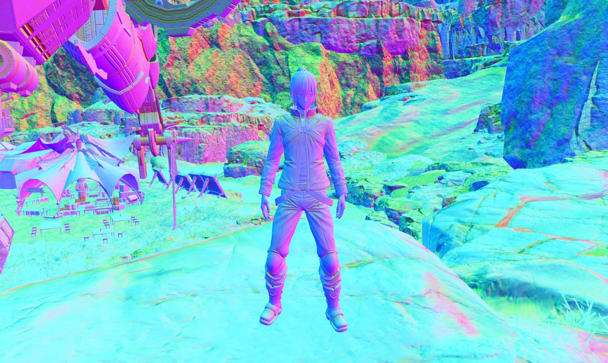
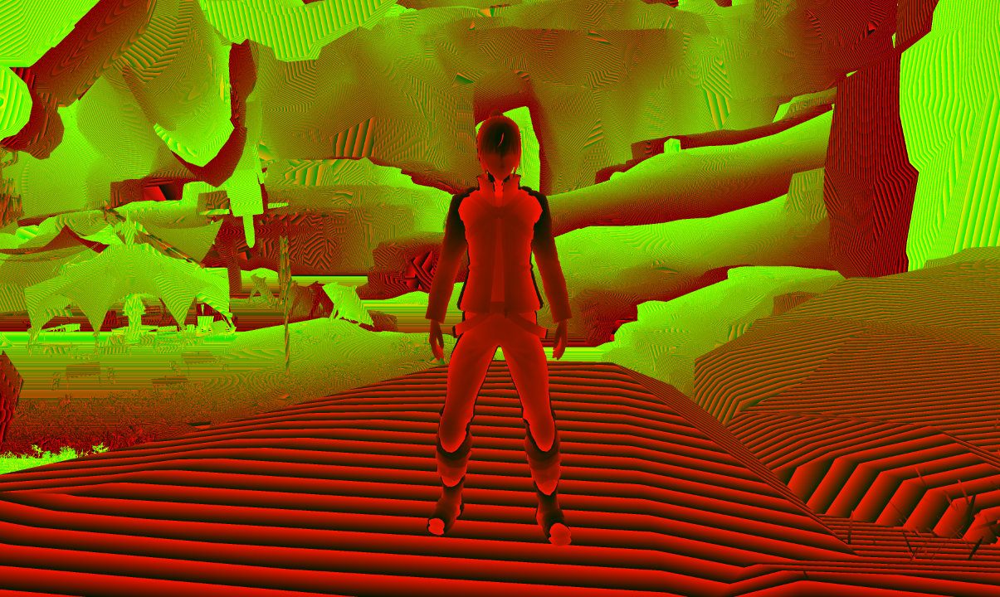

# GBuffer
The G-Buffer or GBuffer contains all the screenspace textures used for the deferred lighting pass. This usually contains basic parameters like color and normals but can also contain more obscure values like material ID maps or motion vectors. The following sections describe the GBuffer texture layout used for all of the Xenoblade games for the Switch.

## Color

### Color (RGB)
The color defines the model's albedo or base color. Albedo is the overall color of an object. Surfaces with higher albedo reflect more light and appear brighter than surfaces with low albedo. This corresponds to the base color input of [Blender's Principled BSDF](https://docs.blender.org/manual/en/latest/render/shader_nodes/shader/principled.html).

### ??? (Alpha)

### ??? (Alpha)

## EtcBuffer

The EtcBuffer contains material shading parameters as well as various additional material values packed into the remaining channels.

### Metalness (Red)
Metalness determines whether a surface is metallic or not and affects both specular and diffuse shading. In general, materials should be either fully metallic (1.0) or non metallic (0.0). Values in between 0.0 and 1.0 enable smoother blending between metallic and non metallic regions of a model. Non metals have a white specular color and the diffuse component is colored by the albedo. Metals have no diffuse component and specular intensity is controlled entirely by albedo.

### Glossiness (Green)
The glossiness of a material is the inverse of roughness and affects the size and intensity of specular highlights. This value in game is referred to as "shininess" abbreviated to "shy" or "shiness".

### Material ID (Blue)

### Bit Info (Alpha)
The bit info contains multiple values like the material type. The material type is used to select the appropriate shader for the final deferred lighting pass like toon or PBR. The material type or "matType" is also referred to as "matID" in game code. In this site, "material type" will always refer to the value used to select the lighting shader and "material ID" will always refer to the value written to the etc blue channel to avoid any confusion.

## Normal

### View Normal X+, Y+ (Red, Green)
The red and green channels encode the XY directions of the viewspace normals into the range 0.0 to 1.0. The actual XY values are unpacked in the deferred shading pass. The Z component can be inferred since `x^2 + y^2 + z^2 = 1` for a unit normal.

### Ambient Occlusion (Z)
The blue channel contains the ambient occlusion values. Ambient occlusion maps often look similar to the Z channel of a normal map, but the actual normal Z component is calculated from the normal's XY components.

### ??? (W)

## Velocity
The velocity texture contains an encoded version of the difference in position between the current frame and the previous frame. The RGB colors are often too dark to make out clearly if the camera isn't actively moving.

## Depth

## LgtColor