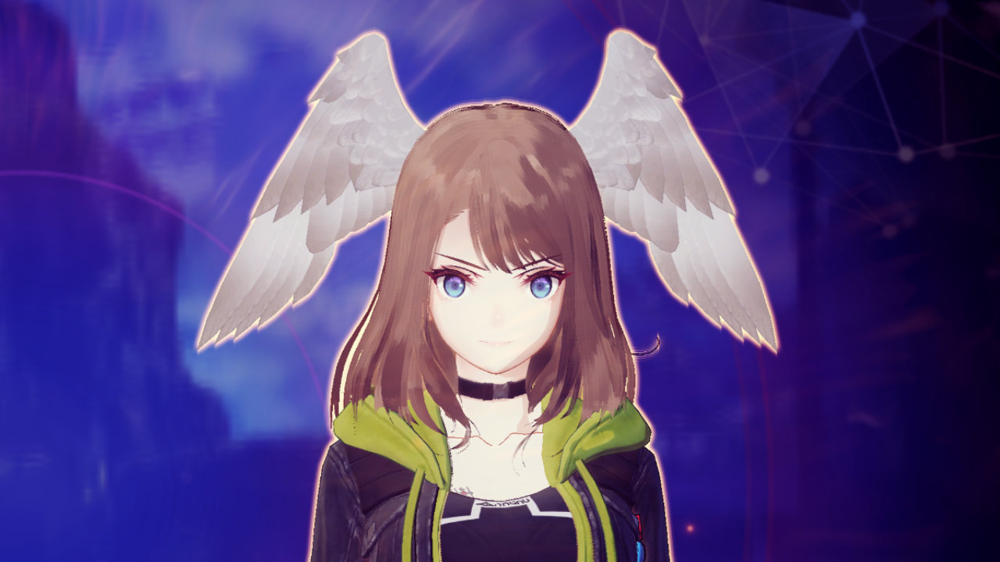

# Hair Materials

## Hair SNN Blur (Xenoblade 3)

  
  

The highly detailed hair textures in Xenoblade 3 help give hair the illusion of being made up of individual strands but would appear heavily aliased in game without any filtering. The game applies a post processing blur function known as symmetric nearest neighbor (SNN) to hair materials. This reduces aliasing artifacts while also giving hair a stylized or painterly look similar to the Kuwahara or "oil paint" filters found in some image editing programs.

Blur functions typically work by computing a weighted average of a pixel and its neighboring pixels. An SNN blur function compares a pair of opposite pixels to the central pixel and picks the pixel with the most similar color to blur. This blurs similarly colored regions while still preserving some edges. The in game shader code is modified from the standard formulation to only blur horizontally. This improve performance while still preserving the vertical hair strands as long as characters are standing upright.

The game masks the blur effect to only apply to hair materials using stencil testing values defined in the model's materials. This is separate from the hair material type that is defined by the model's material parameters. Most materials in Xenoblade 3 that use the hair material type also use the correct stencil values to enable the hair blur.