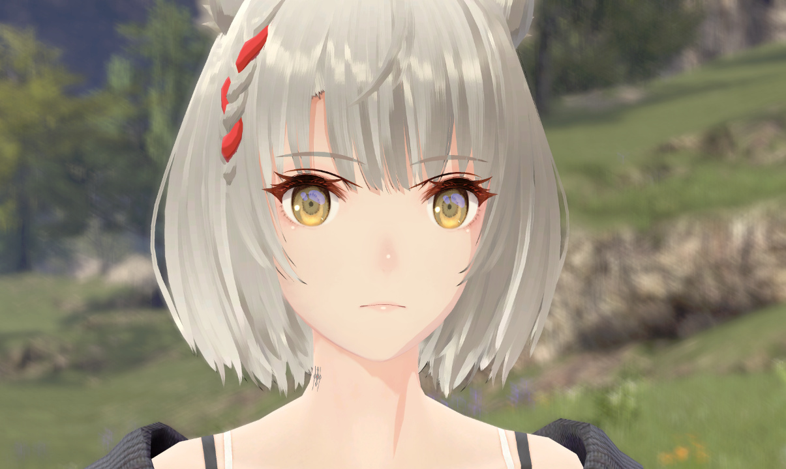

# Outlines

  
  

Outline rendering adds a stylized border around character models in game. The effect can be subtle in game and may only be visible in some games while zoomed in. Outlines use the "inverted hull" technique that culls the back faces of the mesh and the front faces of the outline mesh. The outline mesh is scaled along the normal or "inflated" to adjust the outline thickness.

The outline color and thickness are controlled by a vertex color attribute in a special outline buffer. The RGB components of the outline vertex color control the color of the outline. The alpha component controls the thickness of the outline by scaling the distance each point is translated along its normal. An alpha of 0.0 disables the outline completely.