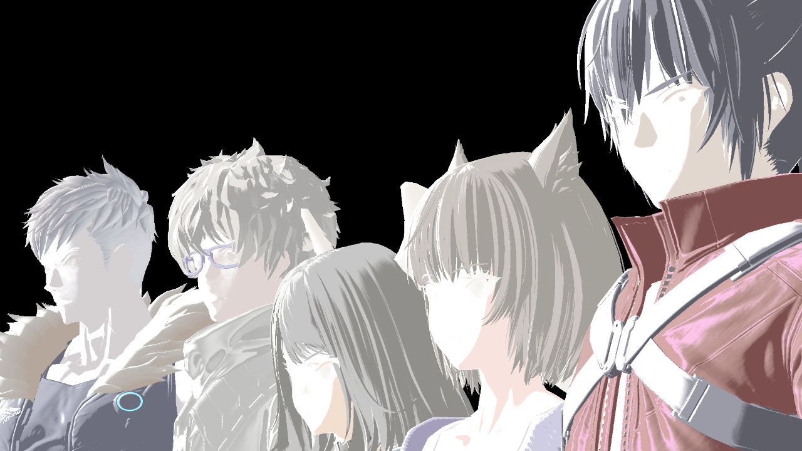
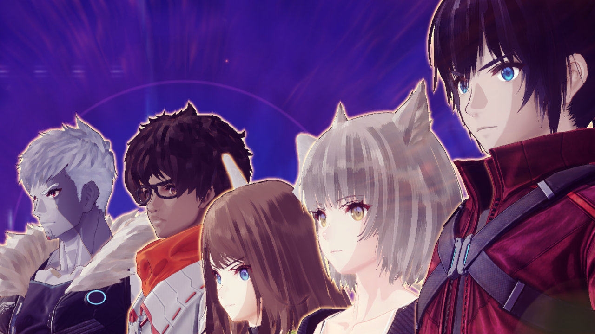

# Toon Materials

  
  

Toon materials and hair materials use color gradient textures for controlling diffuse shading. The above image compares the selected in game gradient (left) with the final rendered result (right) for both toon and hair materials.

Gradients are shared for all models and defined in files like `monolib/shader/toon_grad.witex`. Each row of the gradient texture defines a unique RGB gradient ramp. Each model specific shader writes a value to the EtcBuffer G-Buffer texture to determine which gradient to use for rendering. 

Toon materials can also have specular shading colored by the specular output of the G-Buffer. This technique is common in Xenoblade 2 for character models.
